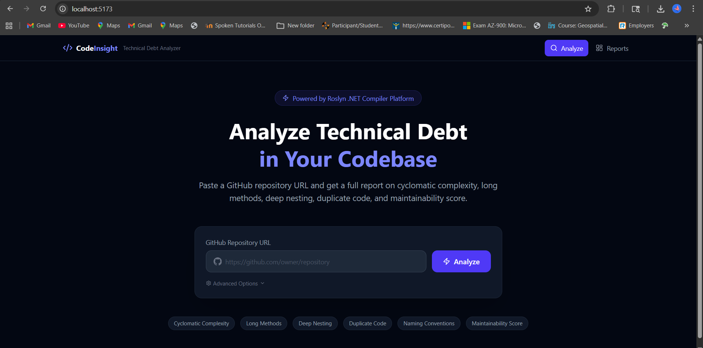
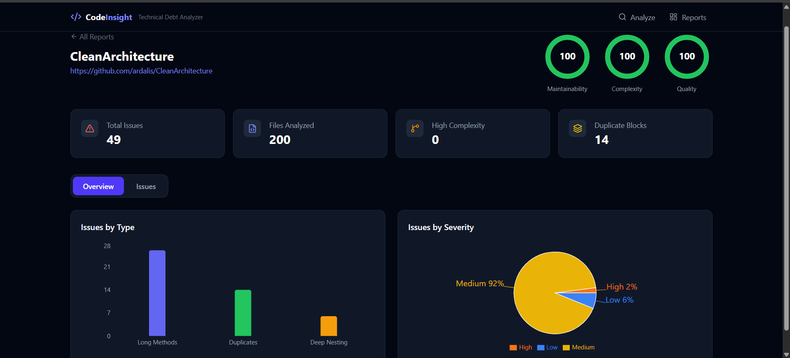
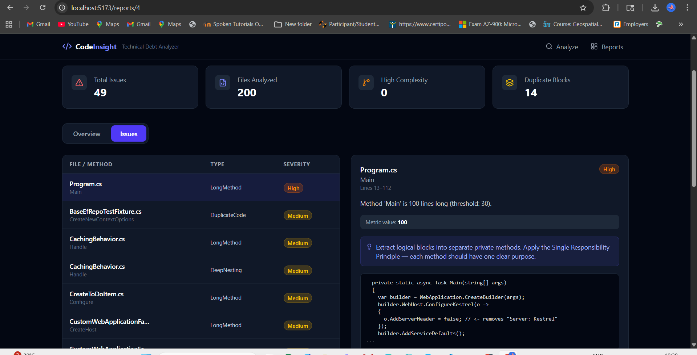
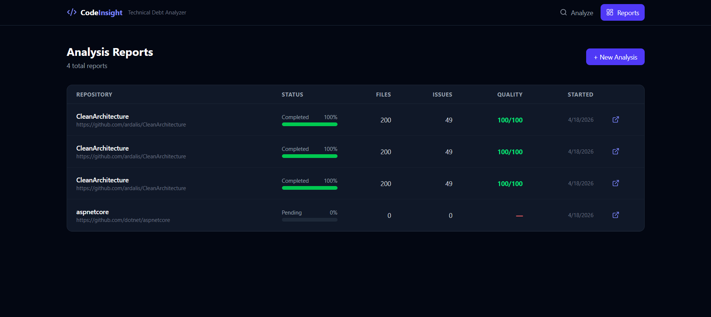

# CodeInsight – Technical Debt Analyzer

> An enterprise-grade full-stack developer tool that analyzes GitHub repositories for technical debt using the **Roslyn .NET Compiler Platform**.

---

## 📸 Screenshots

### 🏠 Home — Analyze Page


---

### 📊 Report Overview — Scores & Charts


---

### 🐛 Issues Detail View — Code Snippets & Suggestions


---

### 📋 All Reports Dashboard


---

## 🎯 What It Does

CodeInsight clones a GitHub repository, scans all `.cs` files using Roslyn, and produces a detailed technical debt report including:

| Analysis | Description |
|----------|-------------|
| **Cyclomatic Complexity** | Detects methods with too many branching paths |
| **Long Methods** | Flags methods exceeding a configurable line threshold |
| **Deep Nesting** | Identifies deeply nested code blocks |
| **Duplicate Code** | Finds structurally similar code blocks across files |
| **Naming Conventions** | Catches non-PascalCase methods and non-descriptive variables |
| **Maintainability Score** | 0–100 score weighted by issue severity |

---

## 🏗️ Tech Stack

| Layer | Technology |
|-------|-----------|
| Backend | ASP.NET Core 10 Web API |
| Language | C# |
| Code Analysis | Roslyn (Microsoft.CodeAnalysis.CSharp) |
| ORM | Entity Framework Core 9 |
| Database | SQLite (zero-config, file-based) |
| Frontend | React 19 + TypeScript + Vite |
| UI | Tailwind CSS v4 |
| Charts | Recharts |
| Logging | Serilog |
| API Docs | Swagger / OpenAPI |

---

## 🧱 Architecture

```
CodeInsight/
├── CodeInsight.Core/            # Entities, DTOs, Interfaces (no dependencies)
├── CodeInsight.Analysis/        # Roslyn analyzers + orchestrator
├── CodeInsight.Infrastructure/  # EF Core, repositories, GitHub service
├── CodeInsight.API/             # Controllers, services, middleware
└── codeinsight-ui/              # React + TypeScript frontend
```

**Clean Architecture layers:**
- `Controllers` → `Services` → `Repositories` → `Database`
- All dependencies point inward — Core has zero external dependencies
- SOLID principles throughout with full dependency injection

---

## 🔑 Core Features

### 1. GitHub Repository Analyzer
- Input any public GitHub repo URL
- Clones with `--depth 1` for speed
- Scans up to 200 `.cs` files per analysis

### 2. Code Analysis Engine (Roslyn)
- Parses real C# syntax trees — not regex
- Detects issues at method/file level with exact line numbers
- Extracts code snippets for each issue

### 3. Technical Debt Report
- Stored in SQLite via EF Core
- Maintainability, Complexity, and Quality scores (0–100)
- Issue breakdown by type and severity

### 4. Refactoring Suggestions
- Every issue includes a specific, actionable suggestion
- Examples: *"Use early returns to reduce nesting"*, *"Extract reusable logic into a shared method"*

### 5. Dashboard UI
- Real-time progress indicator during analysis
- Score rings, bar charts, pie charts
- Paginated issues table with click-to-inspect detail panel
- Code snippet viewer with severity badges

---

## ⚡ Advanced Features

- **Background processing** — analysis runs async, UI polls for updates
- **Progress indicator** — live percent progress bar
- **Serilog logging** — structured logs to console + rolling file
- **Global exception middleware** — consistent error responses
- **Memory caching** — completed reports cached for 5 minutes
- **Pagination** — all list endpoints paginated

---

## 🗄️ Database Schema

```
Repositories          AnalysisReports           CodeIssues
─────────────         ───────────────────        ──────────────────
Id                    Id                         Id
Name                  RepositoryId (FK)          ReportId (FK)
Url (unique)          Status                     FilePath
Owner                 TotalFilesAnalyzed         FileName
Description           TotalIssuesFound           IssueType
Language              MaintainabilityScore       Severity
Stars                 ComplexityScore            Description
CreatedAt             CodeQualityScore           Suggestion
                      ProgressPercent            MethodName
                      StartedAt                  LineStart / LineEnd
                      CompletedAt                MetricValue
                                                 CodeSnippet
```

---

## 🧪 API Endpoints

| Method | Endpoint | Description |
|--------|----------|-------------|
| `POST` | `/api/analyze` | Submit a GitHub repo for analysis |
| `GET` | `/api/reports` | List all reports (paginated) |
| `GET` | `/api/reports/{id}` | Get detailed report with issues |
| `GET` | `/api/issues/{reportId}` | Get paginated issues for a report |

Swagger UI available at: `http://localhost:5000/swagger`

---

## 🚀 Getting Started

### Prerequisites
- [.NET 10 SDK](https://dotnet.microsoft.com/download)
- [Node.js 18+](https://nodejs.org)
- [Git](https://git-scm.com) (must be in PATH for cloning repos)

### 1. Clone this repo
```bash
git clone <this-repo-url>
cd CodeInsight
```

### 2. Start the backend
```powershell
# Add dotnet to PATH if needed (first time only)
$env:PATH = "C:\Program Files\dotnet;" + $env:PATH

dotnet run --project CodeInsight.API/CodeInsight.API.csproj
```

The SQLite database is created automatically on first run.  
API available at: `http://localhost:5000`  
Swagger UI at: `http://localhost:5000/swagger`

### 3. Start the frontend
```powershell
# In a second terminal
npm run dev --prefix codeinsight-ui
```

Frontend at: **http://localhost:5173**

---

## 💡 Usage

1. Open `http://localhost:5173`
2. Paste a **public GitHub C# repository URL**
3. Click **Analyze**
4. Wait for analysis to complete (30–90 seconds depending on repo size)
5. View scores, charts, and detailed issue breakdown

### Good repos to try
```
https://github.com/ardalis/CleanArchitecture
https://github.com/jasontaylordev/CleanArchitecture
https://github.com/dotnet/samples
```

> ⚠️ CodeInsight only analyzes `.cs` files. Non-.NET repos will show 0 results.

---

## 📁 Project Structure

```
CodeInsight.Core/
├── Entities/          Repository, AnalysisReport, CodeIssue
├── DTOs/              Request/response data transfer objects
└── Interfaces/        IAnalysisService, ICodeAnalyzer, IGitHubService, ...

CodeInsight.Analysis/
├── Analyzers/         CyclomaticComplexity, LongMethod, DeepNesting,
│                      DuplicateCode, NamingConvention analyzers
└── Engine/            RoslynCodeAnalyzer, RepositoryAnalysisOrchestrator

CodeInsight.Infrastructure/
├── Data/              AppDbContext (EF Core + SQLite)
├── Repositories/      Repository, AnalysisReport, CodeIssue repositories
└── Services/          GitHubService (clone + metadata)

CodeInsight.API/
├── Controllers/       AnalysisController
├── Services/          AnalysisService (orchestrates everything)
└── Middleware/        ExceptionHandlingMiddleware

codeinsight-ui/
├── src/api/           Axios API client
├── src/components/    ScoreRing, StatCard, SeverityBadge, ProgressBar, Navbar
├── src/pages/         HomePage, ReportsPage, ReportDetailPage
└── src/types/         TypeScript interfaces
```

---

## 🔧 Configuration

`CodeInsight.API/appsettings.json`:
```json
{
  "ConnectionStrings": {
    "DefaultConnection": "Data Source=codeinsight.db"
  },
  "GitHub": {
    "Token": ""
  }
}
```

Add a GitHub personal access token to avoid API rate limits when fetching repo metadata.

---

*Built with ❤️ using ASP.NET Core, Roslyn, React, and Tailwind CSS*
